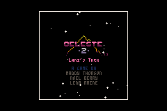
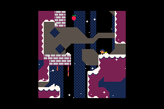
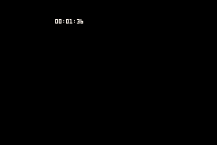
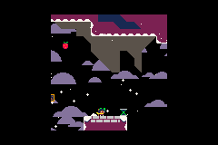

# Celeste Classic 2 GBA port
A port of Celeste Classic 2 for the Game Boy Advance.
The original port was made by [Skaleee](https://github.com/Skaleee/Celeste2-GBA).
This fork just adds automatic save when the character die or enter a new level.

# Original Game Credits
The game was [originally](https://github.com/ExOK/Celeste2) made by Maddy Thorson, Noel Berry, and Lena Raine for the PICO8.  

Play the original game and view its source at https://www.lexaloffle.com/bbs/?tid=41282.

# Current Controls
- DPAD - move
- A/L - jump
- B/R - grapple
- Select - pause
- hold L+R+A+B and press START - reset game
- hold L+R+DOWN+B and press START - reset to the last level saved

# Screenshots





# Building
Install [devkitpro](https://devkitpro.org/wiki/Getting_Started) and install GBA Development support. Then run `make` in a Terminal in the root of this project. 
This will build the GBA file in the root of this project
                                                                          
By default, the game saves to SRAM. To build a ROM that save to flash memory (at least to some repro cart), try:
```
make EXTRA_CFLAGS=-DFLASH_RAM
```


It's also possible to change the output file name prefix (the full name will include the version number):
```
make TARGET_PREFIX=Celeste-Classic-2
```


# Celeste Classic GBA
Also check out the GBA port of the first game Celeste Classic: https://github.com/JeffRuLz/Celeste-Classic-GBA
