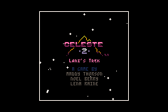
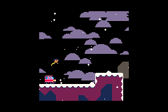
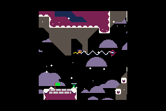

# Celeste Classic 2 GBA port
A port of Celeste Classic 2 for the Game Boy Advance.

This was my first project for the GBA. The goal was to make it as accurate to the original game as I could. It has some very minor graphical changes, but the gameplay is exactly the same.  
I ported the audio as best as I could. If someone can/wants to improve the audio, I will gladly merge it.  
This port was tested on Emulator, real GBA and 3DS virtual console.

# Original Game Credits
The game was [originally](https://github.com/ExOK/Celeste2) made by Maddy Thorson, Noel Berry, and Lena Raine for the PICO8.  

Play the original game and view its source at https://www.lexaloffle.com/bbs/?tid=41282.

# Current Controls
- DPAD - move
- A/L - jump
- B/R - grapple
- Select - pause
- hold L+R+DOWN+B and press START - reset game

# Screenshots

# Building
Install [devkitpro](https://devkitpro.org/wiki/Getting_Started) and install GBA Development support. Then run `make` in a Terminal in the root of this project. This will build the GBA file in the root of this project

# About Development
There is another Readme under `tools_and_notes` with info about my tools etc.